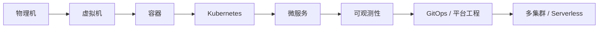
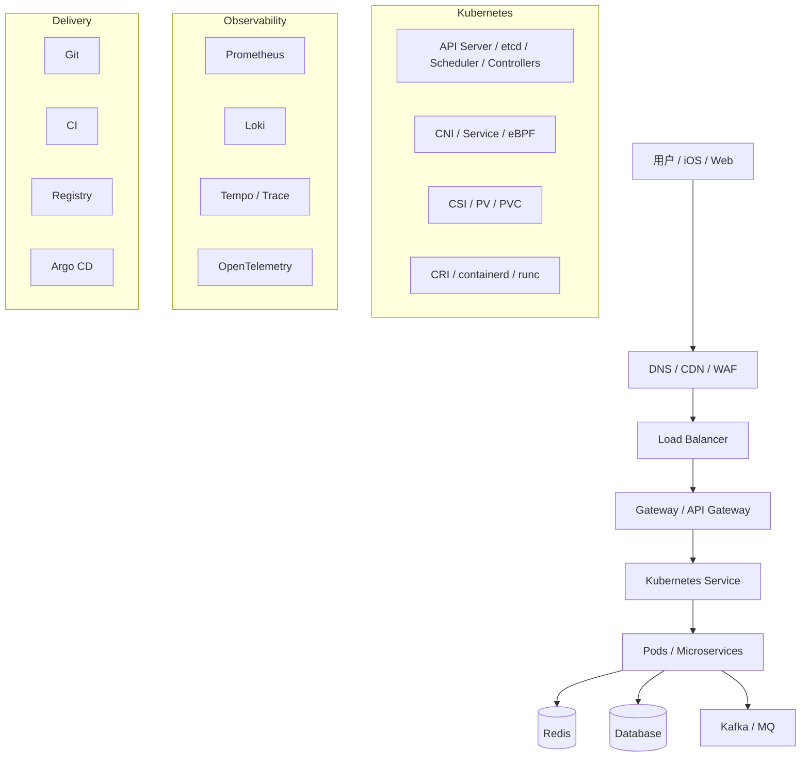

# 00 · 云原生架构全貌

<div class="chapter-meta"><span>目标：建立全局地图</span><span>适合：前端/客户端开发转架构视角</span></div>

> 云原生不是“把应用放到云服务器”。它是一套用标准化、声明式和自动化的方法，让应用可以被快速交付、弹性伸缩、自动恢复、持续观测和安全治理的工程体系。

## 1. 从一台服务器开始

传统系统常见形态：

```text
应用
↓
操作系统
↓
服务器
```

当业务增长后，会遇到资源浪费、环境不一致、扩容慢、发布风险高、人工运维多等问题。演进路线通常是：



关键不是“技术越来越多”，而是抽象层不断提高。

## 2. 云原生的六个核心思想

1. **标准化**：OCI 镜像、CRI/CNI/CSI 等接口让生态可以替换和组合。
2. **声明式**：描述“我要什么”，平台负责达到目标，而不是手工执行每一步。
3. **不可变**：不 SSH 上服务器修补应用，改代码后重新构建制品。
4. **弹性**：流量增加时扩 Pod，资源不足时扩 Node。
5. **自愈**：Pod、Node 失败后通过控制循环恢复期望状态。
6. **可观测**：Metrics、Logs、Traces、Profiles 共同解释系统内部状态。

## 3. 一张完整地图



## 4. 三条平面同时存在

任何云原生系统都可以同时从三个视角看：

- **数据平面 Data Plane**：业务请求真正流过哪里。
- **控制平面 Control Plane**：谁决定副本数、调度位置、路由规则和配置。
- **可观测平面 Observability Plane**：谁记录指标、日志、链路和事件。

例如请求“申请额度”时：

```text
数据平面：
App → Gateway → Credit → Risk → DB → Kafka

控制平面：
API Server / Controller / Scheduler / kubelet / HPA

可观测平面：
Prometheus / OpenTelemetry / Loki / Tempo
```

## 5. CRI / CNI / CSI：Kubernetes 三个关键接口

| 接口 | 解决问题 | 常见实现 |
|---|---|---|
| CRI | 容器如何运行 | containerd、CRI-O |
| CNI | Pod 网络如何配置 | Cilium、Calico、Flannel |
| CSI | 存储如何提供和挂载 | EBS CSI、Ceph CSI |

它们体现了云原生最重要的工程原则：**面向接口，而不是绑定实现**。

## 6. 一次真实请求的全链路

```text
iOS App
→ 公网 DNS
→ CDN/WAF
→ Cloud Load Balancer
→ Gateway
→ API Gateway
→ CoreDNS / Service
→ iptables / IPVS / eBPF
→ CNI 路由
→ Pod
→ Redis / DB / Kafka
```

与此同时：

```text
OpenTelemetry 记录 Trace
Prometheus 记录 Metrics
Loki 收集 Logs
Kubernetes Controller 维持副本
HPA 根据负载扩容
```

这就是后续所有章节的主线。

## 7. 云原生不是“越复杂越先进”

小团队和早期业务常常更适合：

```text
模块化单体
+ 容器
+ 托管数据库
+ 基础 CI/CD
```

只有当组织、业务和流量真正出现需求时，再引入微服务、Service Mesh、多集群等复杂能力。

**架构成熟的标志不是技术名词多，而是复杂度与问题匹配。**
