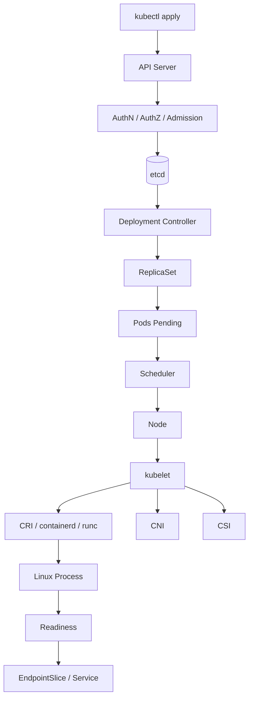

# 02 · Kubernetes：声明式分布式控制系统

<div class="chapter-meta"><span>API Server</span><span>etcd</span><span>Controller</span><span>Scheduler</span><span>kubelet</span></div>

> Kubernetes 不只是“容器管理工具”。更准确地说，它是一套声明式分布式控制系统。

## 1. 一次 kubectl apply 发生了什么



## 2. Everything is API

kubectl 本质只是 Kubernetes API Client。

```text
kubectl
Scheduler
Controller
kubelet
Operator
Argo CD
      ↓
  API Server
      ↓
    etcd
```

组件不应该随意直接修改彼此状态，所有关键状态统一通过 API。

## 3. 请求进入 API Server 的关卡

顺序可理解为：

```text
Authentication
→ Authorization
→ Admission
→ Validation / Persistence
```

- Authentication：你是谁。
- Authorization：你能做什么，常见 RBAC。
- Admission：即使有权限，这个对象是否符合平台策略；还可进行自动注入和修改。

## 4. etcd 是集群“事实数据库”

保存的是 Kubernetes 资源状态，而不是业务数据：

```text
Pod / Deployment / Service
ConfigMap / Secret
Node / Namespace
RBAC / CRD
```

etcd 使用 Raft 保证分布式一致性。3 个节点通常需要 2 个多数派，5 个需要 3 个，因此常用奇数规模。

## 5. Desired State：Kubernetes 的灵魂

传统命令式：

```text
启动1个
再启动1个
再启动1个
```

Kubernetes：

```yaml
spec:
  replicas: 3
```

表达的是：

> “无论发生什么，我希望最终有 3 个副本。”

## 6. Reconciliation Loop

控制器不断比较：

```text
Desired State
      ↓
   Compare
      ↓
Current State
      ↓
 Take Action
      ↓
再比较……
```

如果期望 3、实际 2，就创建 1 个；实际 4，就缩掉 1 个。

**所谓自愈，本质就是持续调谐。**

## 7. spec 和 status

```yaml
spec:
  replicas: 3

status:
  replicas: 3
  readyReplicas: 2
```

- spec：期望状态。
- status：系统观察到的当前状态。

Controller 的工作就是让 status 尽量接近 spec。

## 8. List / Watch / Informer

Controller 不会每秒全量查询 API Server。

典型模式：

```text
List 一次初始对象
+
Watch 后续变化
+
Informer 本地缓存
+
WorkQueue 异步处理
```

这套事件驱动设计是 Kubernetes 能管理大量资源的重要基础。

## 9. Deployment / ReplicaSet / Pod 分工

```text
Deployment
负责版本、滚动发布、回滚
↓
ReplicaSet
负责维持副本数
↓
Pod
实际运行应用
```

滚动更新 v1 → v2 时，Deployment 创建新的 ReplicaSet，并逐步扩大新版本、缩小旧版本。

## 10. Scheduler 怎么选 Node

调度通常可抽象成：

```text
Filter
→
Score
→
Bind
```

考虑：

- CPU / Memory Requests。
- NodeSelector / NodeAffinity。
- PodAffinity / PodAntiAffinity。
- Taints / Tolerations。
- Volume Topology。
- Zone / Host 分布。

### Taint / Toleration

可以类比：

```text
Taint = 节点门禁
Toleration = Pod 通行证
```

### Anti-Affinity

关键服务 3 个副本最好分散到不同 Node / Zone，避免单机故障全部带走。

## 11. kubelet 是 Node Agent

Scheduler 只负责“决定放哪儿”，不启动容器。

目标 Node 的 kubelet 观察 API Server，发现分配给自己的 Pod 后：

```text
kubelet
→ CRI
→ containerd
→ runc
→ Linux Process
```

同时协调网络 CNI、存储 CSI 和 Probe。

## 12. Probe：启动、存活与接流量

- startupProbe：应用是否完成启动。
- readinessProbe：现在是否可以接流量。
- livenessProbe：进程是否已失去正常工作能力，需要重启。

Readiness 失败通常应先从 Service Endpoint 移除，而不是立刻重启。

## 13. CRD 与 Operator

CRD 让 Kubernetes API 可以理解新资源，例如：

```yaml
kind: PostgreSQLCluster
spec:
  instances: 3
```

Operator = CRD + Controller + 领域运维知识。

它把数据库管理员过去手工做的主从、备份、升级、故障切换等规则写成 Reconcile 逻辑。

## 14. Control Plane 与 Data Plane

```text
Control Plane:
API Server
etcd
Scheduler
Controller Manager

Data Plane:
Node
kubelet
containerd
Pods
CNI / Service Networking
```

Control Plane 挂掉不一定让现有业务请求立即停止，因为已经运行的数据平面通常还能继续工作；但部署、调度、扩缩容和状态调谐会受影响。

## 15. Kubernetes 五条核心记忆

1. Everything is API。
2. Desired State。
3. Reconciliation。
4. Controller 分工。
5. 通过状态协作而不是组件强耦合。

理解这五点，就理解了 Kubernetes 的核心设计。
