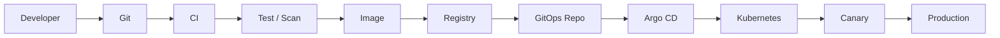

# 07 · CI/CD、GitOps 与平台工程

<div class="chapter-meta"><span>CI</span><span>Registry</span><span>Argo CD</span><span>Helm</span><span>Platform Engineering</span></div>

## 1. 从代码到生产



CI 的目标是“把源代码变成可信制品”；CD 的目标是“把可信制品安全送进环境”。

## 2. CI Pipeline

成熟 CI 可能包括：

```text
Checkout
→ Lint
→ Unit Test
→ Integration Test
→ Build
→ SAST
→ Dependency Scan
→ Build Image
→ Image Scan
→ SBOM
→ Sign
→ Push Registry
```

Test Pyramid 强调大量快速 Unit Test，较少 Integration Test，更少而关键的 E2E。

## 3. Build Once, Deploy Many

生产不要依赖 `:latest`。

应使用固定版本甚至 Digest：

```text
credit-service:1.3.8
image@sha256:...
```

同一 Image 经 Dev → Staging → Prod，环境差异通过 Config / Secret 注入。

## 4. Registry / Harbor

Registry 不只是“存镜像”，企业还需要：

- 权限与 Robot Account。
- 漏洞扫描。
- 镜像复制。
- Retention。
- 审计。
- 签名验证。

Harbor 是常见私有 Registry 方案。

## 5. SBOM 与签名

SBOM 是“软件配料表”，记录镜像中有哪些 OS Package、Library、Dependency。

镜像签名（如 Cosign/Sigstore）回答：

> 这个镜像是否由可信 CI 构建，内容是否被篡改？

Admission Policy 可拒绝无可信签名的生产镜像。

## 6. Continuous Delivery vs Deployment

Continuous Delivery：始终具备发布条件，但生产可以人工批准。  
Continuous Deployment：通过质量门后自动进入生产。

## 7. Push CD 的问题

传统 Jenkins：

```text
CI/CD Server
→ kubectl apply
→ Production
```

意味着 CI 系统持有生产集群高权限凭证，而且 Git 状态可能与真实生产产生 Configuration Drift。

## 8. GitOps

GitOps 规定：

> Git 是期望状态的可信来源。

```text
Git Desired State
→ Argo CD / Flux Controller
→ Kubernetes Actual State
→ Reconcile
```

它与 Kubernetes 自身“声明式 + 调谐”思想完全一致。

## 9. CI 与 GitOps 的边界

推荐：

```text
CI:
Source → Test → Image → Registry

CD:
更新 GitOps Repo
→ Argo CD
→ Kubernetes
```

这样 CI 不必直接掌握生产 Kubeconfig。

Git 同时成为生产变更的审计日志：谁改、为什么改、谁 Review、何时回滚都可追踪。

## 10. Helm

Helm = Kubernetes 模板 + 包管理。

一个 Chart 可能包含 Deployment、Service、HPA、Ingress、ConfigMap 等。

适合第三方软件安装和复杂参数化。

## 11. Kustomize

Kustomize 更强调：

```text
Base
+
Overlay / Patch
```

例如 dev 2 副本、prod 10 副本，而不复制整套 YAML。

粗略选择：

- 第三方软件包：Helm 很常见。
- 自家应用环境差异：Kustomize 很自然。
- 两者也可组合。

## 12. 发布策略

### Rolling
逐步替换旧 Pod，简单、资源成本低。

### Blue-Green
同时准备 v1/v2 两套环境，流量瞬间切换；回滚快但资源成本高。

### Canary
5% → 20% → 50% → 100%，根据指标决定是否继续。

Canary 不仅看 HTTP 200 和 P99，还必须看业务指标，例如额度申请成功率、支付成功率。

## 13. Argo Rollouts

在 Kubernetes Deployment 之外提供更高级的：

- Canary。
- Blue-Green。
- Step Pause。
- Prometheus Analysis。
- 自动 Abort / Rollback。

这属于 Progressive Delivery。

## 14. Feature Flag：Deploy ≠ Release

部署 v2 并不意味着新功能必须立刻对 100% 用户开放。

```text
Deploy Code
→ Feature Disabled
→ Internal
→ 1%
→ 10%
→ 100%
```

功能有问题时关闭 Flag，不一定需要回滚整个制品。

## 15. 数据库发布与 Expand / Contract

危险：

```text
新版本直接 DROP old_field
→ 应用回滚
→ 老版本仍需要 old_field
→ 回滚失败
```

安全演进：

```text
Expand：新增 new_field，双写/兼容
→ 数据迁移
→ 新版本稳定
→ Contract：最后删除 old_field
```

## 16. Terraform / OpenTofu 的位置

Kubernetes YAML 管理集群内部对象。  
IaC 管理更底层的 VPC、Subnet、Cluster、RDS、IAM、DNS、Object Storage 等。

```text
Terraform / OpenTofu
→ Cloud Infrastructure
→ Kubernetes Cluster
→ Argo CD
→ Applications
```

IaC 偏 Provisioning；GitOps Controller 更强调长期持续 Reconcile。

## 17. 为什么出现 Platform Engineering

业务开发者不应该每天都研究：

```text
Helm
RBAC
Ingress
PrometheusRule
NetworkPolicy
Terraform
```

平台工程把这些能力产品化成 Internal Developer Platform（IDP）。

开发者只描述：

```text
Service Name
Language
Database
Exposure
SLO
```

平台生成 Repo、CI、Helm、GitOps、监控、Secret、Dashboard 等。

## 18. Golden Path

平台团队提供“正确而且最容易走”的标准路径：

```text
Java Service Template
├─ Health Check
├─ OTel
├─ Dockerfile
├─ CI
├─ Helm
├─ SLO
└─ Security Policy
```

不是为了限制开发者，而是把最佳实践默认化。

## 19. Backstage / Service Catalog

微服务达到几百个后，需要回答：

- 服务 Owner 是谁？
- 源码在哪？
- API 文档在哪？
- 依赖谁？
- Dashboard / Runbook 在哪？

Backstage 等 Developer Portal 将这些信息整理成服务目录，并支持模板化创建服务。

## 20. DevOps 与 Platform Engineering

DevOps 更像文化和协作原则；Platform Engineering 是把这些原则实现成“内部产品”。

一个成熟平台的目标是：

> 让业务团队自助完成标准交付，同时让安全、可观测和治理能力默认存在。
