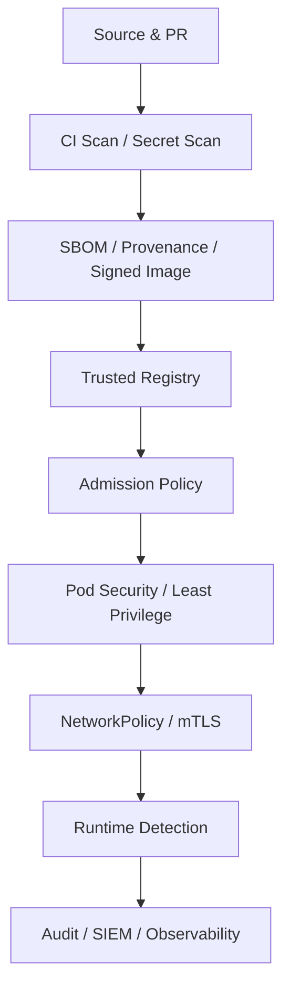

# 08 · 云原生安全：从供应链到运行时的纵深防御

<div class="chapter-meta"><span>Zero Trust</span><span>IAM/RBAC</span><span>Secrets</span><span>Policy as Code</span><span>Runtime Security</span></div>

> 云原生安全不是安装一个“安全产品”，而是从代码、构建、镜像、身份、网络、运行时到数据的一整条防御链。

## 1. 先看攻击面

```text
Source Code
→ Dependencies
→ CI Runner
→ Container Image
→ Registry
→ Kubernetes API
→ Pod / Node
→ Network
→ Secrets / Data
→ Cloud IAM
```

任何一层失守，都可能向下扩散。

## 2. Authentication / Authorization / Admission

Kubernetes API 典型安全链：

```text
Authentication：你是谁
→ Authorization：你能做什么
→ Admission：这个操作是否符合策略
```

RBAC 应遵循 Least Privilege。

不要给所有开发者：

```text
cluster-admin
```

应按 Namespace、Resource、Verb 精确授权。

## 3. ServiceAccount

Pod 不应该使用人的长期凭证访问 Kubernetes API。

ServiceAccount 为工作负载提供机器身份。

安全原则：

- 不需要 API 就不要自动挂 Token。
- 为不同服务使用不同 ServiceAccount。
- 配置最小 RBAC。
- 云上优先 Workload Identity / IRSA 等短期身份映射，而不是把 Cloud Access Key 塞入 Secret。

## 4. Secret 为什么不等于“安全保险箱”

Kubernetes Secret 主要是 API 对象层面的敏感配置抽象；Base64 并不是加密。

生产需要考虑：

- etcd Encryption at Rest。
- RBAC。
- Secret Rotation。
- 外部 Secret Manager。
- Audit。

常见外部系统：Vault、AWS Secrets Manager、Azure Key Vault、GCP Secret Manager。

## 5. Vault 的核心思想

Vault 可以提供：

- 动态短期凭证。
- Lease / TTL。
- 自动 Rotation。
- PKI。
- Encryption as a Service。
- 审计。

相比“一个数据库密码用三年”，更成熟的方式是让工作负载拿到短期凭证。

## 6. Zero Trust

传统思路：

```text
内网 = 可信
```

Zero Trust：

> Never trust, always verify。

即使两个 Pod 在同一个 Cluster，也应基于身份、策略和加密决定是否允许通信。

## 7. NetworkPolicy：东西向微隔离

例如：

```text
credit-service → risk-service  Allow
risk-service   → risk-db       Allow
其他服务       → risk-db       Deny
```

默认允许所有 Pod 互通会让横向移动攻击非常容易。

Cilium/Calico 等负责执行 NetworkPolicy。

## 8. mTLS 与服务身份

mTLS 不只是“加密流量”，还让通信双方互相证明身份：

```text
Credit 证明：我是 Credit
Risk   证明：我是 Risk
```

Service Mesh 可统一处理证书轮换、身份和传输加密。

## 9. 容器为什么不要 root

容器逃逸或错误挂载发生时，root 权限会放大影响。

推荐：

- runAsNonRoot。
- readOnlyRootFilesystem。
- drop Linux Capabilities。
- 禁止 privileged。
- 禁止不必要 hostPath。
- 不使用 hostNetwork / hostPID，除非明确需要。

## 10. Linux Capabilities

传统 root 权限可以拆成较细能力，例如 NET_ADMIN、SYS_ADMIN。

不要因为程序需要绑定某端口就给完整 root，应该只给真正需要的能力。

## 11. seccomp / AppArmor / SELinux

这些属于运行时的系统调用/访问边界。

seccomp 可以限制容器能调用哪些 Linux syscall。

即使应用被攻击，攻击者也会受到第二层约束。

## 12. Pod Security Standards

Kubernetes 提供 Baseline / Restricted 等安全标准思想，平台应把“危险 Pod 配置”在创建时直接阻止，而不是上线后再发现。

## 13. Admission Policy 与 Policy as Code

企业安全要求可以写成机器可执行策略：

- 禁止 privileged。
- 必须设置 resources limits。
- 只能使用公司 Registry。
- 生产镜像必须使用 Digest。
- 必须使用非 root。
- 必须带 Owner / Cost 标签。

常见工具：

- OPA / Gatekeeper。
- Kyverno。
- ValidatingAdmissionPolicy。

原则：

> 让错误配置根本进不了生产，而不是靠 Wiki 提醒。

## 14. 软件供应链安全

供应链链路：

```text
Git Commit
→ CI
→ Dependencies
→ Build
→ Image
→ Registry
→ Deploy
```

需要：

- SAST。
- Dependency Scan。
- Secret Scan。
- Image Scan。
- SBOM。
- Provenance。
- Image Signing。
- Admission Verification。

## 15. SLSA

SLSA 关注构建供应链的完整性与 Provenance，例如：

> 这个制品从哪个源码、由哪个受控 Builder、以什么步骤产生？

SBOM 回答“里面有什么”；Provenance 回答“它怎么来的”。

## 16. CI Runner 也是高价值目标

CI 通常能：

- 读取代码。
- Push 镜像。
- 修改部署仓。
- 访问 Secret。

因此要：

- 最小 Token 权限。
- 短期 OIDC Credential。
- 隔离 Runner。
- 防止不受信任 PR 获得生产 Secret。
- 固定第三方 Action 版本/Digest。

## 17. Registry 安全

生产 Registry 应考虑：

- 私有访问。
- Immutable Tag。
- 漏洞门禁。
- 签名验证。
- Retention。
- 审计。

不要让生产集群随意拉取未知公共 Registry 镜像。

## 18. Node Security

Node 是大量 Pod 的共同信任边界。

需要：

- 最小化宿主机软件。
- OS 补丁。
- 禁止业务 SSH 或严格审计。
- kubelet/API 安全配置。
- Runtime 隔离。
- Dedicated Node / Taint 隔离敏感工作负载。

## 19. Runtime Security / Falco

镜像扫描只能发现“静态已知问题”，无法告诉你运行时是否出现：

- 容器内启动 shell。
- 写入敏感目录。
- 异常 syscall。
- 访问 /etc/shadow。
- 反向连接。

Falco 等工具可以根据 syscall/eBPF 行为做运行时检测。

## 20. Namespace 是不是强安全边界

Namespace 是重要的治理和 RBAC 边界，但并不等价于虚拟机级强隔离。

多租户环境还需要综合：

- RBAC。
- NetworkPolicy。
- ResourceQuota。
- Pod Security。
- Node 隔离。
- Runtime Sandbox（如 Kata Containers 等场景）。
- 独立 Cluster（强隔离需求）。

## 21. 数据安全

金融类系统还必须覆盖：

- Encryption in Transit。
- Encryption at Rest。
- KMS。
- 数据脱敏。
- 数据分级。
- Backup Encryption。
- 日志敏感字段治理。
- Audit Trail。

## 22. 一套纵深防御模型



关键思想：

> 假设某一层迟早会失败，因此必须设计下一层保护。
