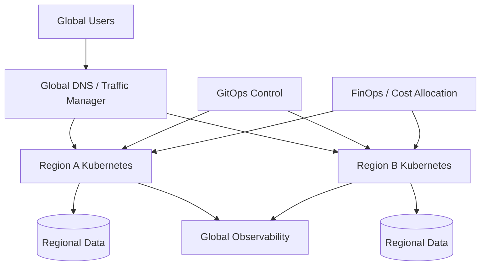

# 09 · 多集群、Serverless、弹性与 FinOps

<div class="chapter-meta"><span>Multi-Cluster</span><span>HA/DR</span><span>Serverless</span><span>KEDA</span><span>FinOps</span></div>

这一章补齐“单个 Kubernetes 集群之外”的云原生世界。

## 1. 为什么会出现多集群

单集群并不是无限扩展的，企业可能因为以下原因拆成多个 Cluster：

- 多地域低延迟。
- 灾难恢复。
- 生产/非生产隔离。
- 业务或租户强隔离。
- 合规与数据驻留。
- 不同云厂商。
- 降低一个控制平面的爆炸半径。

多集群不是目标本身。它会增加网络、身份、配置、观测和发布复杂度。

## 2. 常见多集群模型

### 环境拆分

```text
dev-cluster
staging-cluster
prod-cluster
```

### 地域拆分

```text
cn-east
cn-south
us-west
```

### 业务/租户拆分

关键业务单独集群，避免资源争抢和故障扩散。

## 3. HA 与 DR 不一样

High Availability：局部组件故障后继续服务。  
Disaster Recovery：整个 Zone/Region/Cluster 失效后如何恢复。

必须定义：

- RTO：多久恢复服务。
- RPO：最多允许丢多少时间的数据。

例如：

```text
RTO = 30 min
RPO = 5 min
```

意味着灾难后 30 分钟内恢复，最多接受 5 分钟数据损失。

## 4. Active-Passive vs Active-Active

Active-Passive：

```text
Region A Active
Region B Standby
```

成本较低，切换需要流程。

Active-Active：

```text
Region A ←→ Region B
两边同时接流量
```

恢复更快，但数据一致性、冲突处理和成本复杂得多。

## 5. 多集群流量

北南流量可能通过 Global DNS / GSLB / Anycast 把用户引导到健康地域。

东西向跨集群通信可以通过：

- Gateway。
- Service Mesh Multi-Cluster。
- 专线/VPN。
- Cilium Cluster Mesh 等模式。

架构上应尽量减少“跨 Region 同步调用链”，因为延迟和网络故障会被放大。

## 6. 多集群配置与 GitOps

适合使用：

```text
Git
→ Argo CD / ApplicationSet
→ Cluster A
→ Cluster B
→ Cluster C
```

共享 Base，按环境/地域 Overlay。

不要让每个集群长期靠人手工改，否则 Configuration Drift 很快失控。

## 7. 多集群可观测性

问题从：

> “哪个 Pod 慢？”

升级成：

> “哪个 Cluster / Region / Zone 的哪条链慢？”

需要统一：

- Metrics Federation / Thanos / Mimir。
- Central Logs。
- Cross-cluster Trace。
- Cluster / Region Label。
- Global SLO。

## 8. Serverless 是什么

Serverless 并不是“没有服务器”，而是：

> 服务器生命周期被平台进一步隐藏。

开发者关注：

```text
Function / Service
Event
Business Logic
```

平台处理：

```text
Provision
Scheduling
Scaling
Runtime
Billing
```

典型：AWS Lambda、Cloud Functions、Azure Functions、Knative。

## 9. FaaS 与 Serverless Containers

FaaS：

```text
Event → Function
```

适合短时事件处理。

Serverless Container / Knative：

```text
HTTP Service
→ 自动扩缩容
→ 可以 Scale to Zero
```

更接近普通 Web Service 的编程模型。

## 10. Scale to Zero 的代价

没有请求：

```text
0 instances
```

请求到达：

```text
启动实例
→ 初始化 Runtime
→ 初始化依赖
→ 接请求
```

这会造成 Cold Start。

因此 Serverless 很适合低频、突发、事件驱动任务，但对极低延迟持续流量未必最优。

## 11. HPA / VPA / Cluster Autoscaler

HPA：横向增加 Pod。  
VPA：调整单 Pod 的资源 Request。  
Cluster Autoscaler：Pod 因资源不足 Pending 时增加/减少 Node。

完整链：

```text
流量↑
→ HPA Pod↑
→ Node资源不足
→ Cluster Autoscaler Node↑
```

## 12. KEDA：事件驱动扩缩容

CPU 并不是唯一扩容信号。

例如 Kafka Consumer：

```text
Lag = 100000
```

即使 CPU 不高，也说明消费跟不上。

KEDA 可以根据：

- Kafka Lag。
- Queue Length。
- Prometheus Metric。
- Cloud Queue。
- Event Source。

驱动 Kubernetes 工作负载伸缩，甚至 Scale to Zero。

## 13. Requests / Limits 与调度经济学

Scheduler 主要根据 Requests 判断资源需求。

设置过大：

```text
Request 2 CPU
实际长期 0.2 CPU
```

会造成大量资源“账面被占用”。

设置过小则可能引发竞争、Throttle、OOM。

资源治理是可靠性和成本之间的平衡。

## 14. FinOps 是什么

FinOps 不是“只想省钱”。

它把：

```text
工程
财务
业务
```

放在一起回答：

> 我们花的钱是否产生了合理业务价值？

云原生成本特别容易失控，因为资源可以快速自助创建。

## 15. Kubernetes 成本来源

主要包括：

- Node Compute。
- Persistent Volume。
- Load Balancer。
- Cross-AZ / Cross-Region Network。
- NAT Gateway。
- Observability 数据。
- 闲置 Requests。
- GPU。
- 托管服务。

“CPU 低”并不一定代表可以直接省钱，因为还需看可靠性、峰值和 SLO。

## 16. 成本分摊

建议通过统一 Label：

```text
team=credit
service=risk
env=prod
cost-center=finance
```

把成本归属到 Team / Service / Environment。

没有 Ownership，就很难优化成本。

## 17. Right Sizing

通过长期 P50/P95/P99 使用量，重新评估 Requests / Limits。

例如：

```text
request=4 CPU
P99 usage=0.8 CPU
```

说明可能存在明显浪费。

但必须结合峰值、GC、冷启动和故障流量，不能机械砍资源。

## 18. Spot / Preemptible

批处理、无状态、可中断任务可以使用 Spot 降低计算成本。

关键在线服务必须设计：

- 多副本。
- PodDisruptionBudget。
- 多种 Node Pool。
- 优雅终止。

不要把不可恢复的单实例状态业务直接放 Spot。

## 19. Observability 也是成本大户

高 Cardinality Metrics、全量 Trace、DEBUG 日志保存 90 天，都可能比业务计算还贵。

需要：

- Sampling。
- Retention。
- 冷热分层。
- 日志等级治理。
- Cardinality Control。

## 20. 一张“单集群之外”的架构图



最终目标不是“上多云、上多集群、上 Serverless”，而是针对可靠性、弹性、合规和成本做合理取舍。
