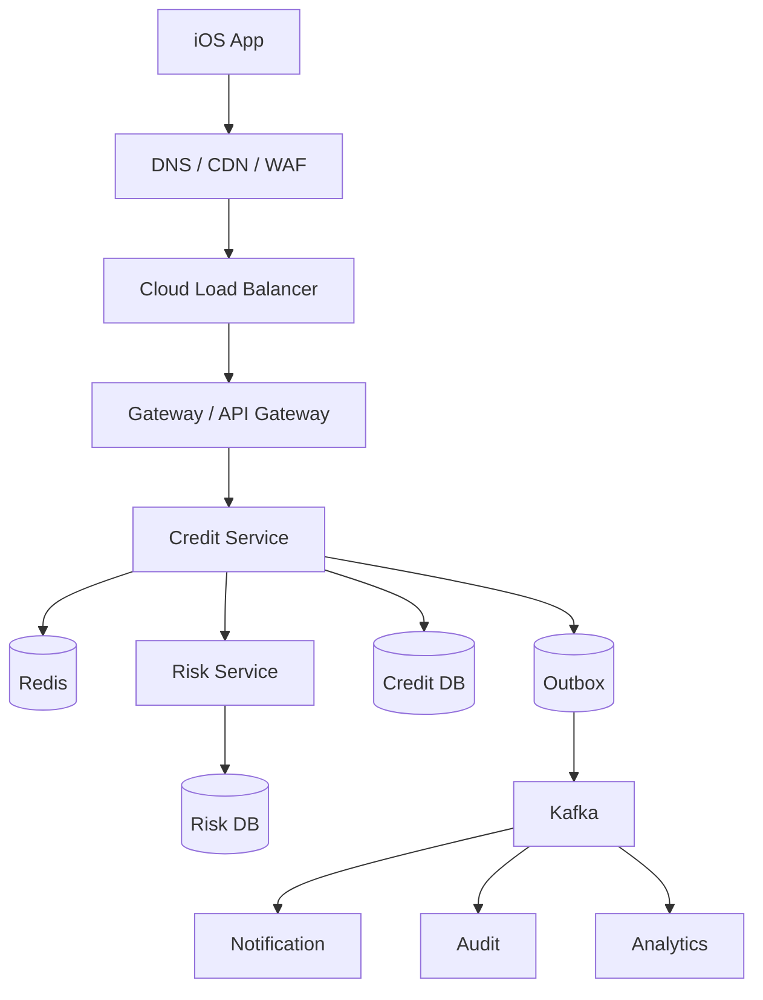

# 10 · 综合案例：消费金融“额度申请”的完整云原生链路

<div class="chapter-meta"><span>从 App 到 Linux Process</span><span>同步 + 异步</span><span>生产故障</span></div>

这一章把前面所有知识串成一条真实链路。业务数据和名称均采用泛化表达。

## 1. 业务目标

用户在 iOS App 点击“申请额度”：

1. 验证用户身份。
2. 防止重复提交。
3. 查询用户基础信息。
4. 调用风控评估。
5. 生成授信额度。
6. 持久化结果。
7. 通知用户。
8. 向审计/数据平台发送事件。

## 2. 全景架构



## 3. 第一步：公网入口

App 发起：

```http
POST /credit/apply
Authorization: Bearer ...
Idempotency-Key: req-abc123
```

公网 DNS 将域名解析到 CDN/WAF/Load Balancer。

WAF 负责：

- DDoS/Bot 防护。
- 常见 Web 攻击规则。
- IP/速率策略。

LB 将流量送入健康的 Kubernetes Gateway。

## 4. Gateway / API Gateway

Gateway 根据 Host/Path 找到后端。

API Gateway 进一步处理：

- Token 校验。
- 用户认证/授权。
- 限流。
- 请求签名。
- API 版本。
- 灰度策略。

这里要避免把复杂业务规则塞到网关里。

## 5. Service Discovery

Gateway 访问：

```text
credit-service
```

CoreDNS：

```text
credit-service
→ ClusterIP
```

Service 数据平面再通过 iptables/IPVS/eBPF 选择 Ready Endpoint。

若目标 Pod 在另一 Node：

```text
Current Node
→ CNI route / tunnel
→ Target Node
→ veth
→ Pod
```

最终到应用 TCP Socket。

## 6. 这个 Pod 是怎么来的

后台同时存在另一条控制链：

```text
Deployment spec replicas=3
→ Deployment Controller
→ ReplicaSet
→ Pod Pending
→ Scheduler 选 Node
→ kubelet
→ containerd
→ runc
→ Linux Process
→ CNI 分配 IP
→ Readiness
→ EndpointSlice
```

业务请求看到的“credit-service”背后，是控制平面长期维持出来的稳定抽象。

## 7. 幂等与重复申请保护

入口请求带：

```text
Idempotency-Key=req-abc123
```

服务端优先通过：

- 业务唯一约束。
- 请求表唯一 Key。
- 状态机。

保证最终幂等。

Redis 可以用于短时间防重复和热点快速判断，但不能替代数据库最终约束。

## 8. 调用 Risk Service

Credit → Risk 可以使用 HTTP/gRPC。

必须配置：

- Timeout。
- 有边界的 Retry。
- Exponential Backoff + Jitter。
- Circuit Breaker。
- Bulkhead。

不要对非幂等操作做盲目透明重试。

## 9. Risk 内部

Risk 可能组合：

```text
规则引擎
+ 特征
+ 模型
+ 黑名单
+ 外部数据
```

该链路属于核心同步路径，应严格控制总 Timeout Budget。

例如总 SLA 800ms，不应该给每个下游都单独 800ms。

## 10. 写数据库 + Outbox

业务成功后：

```text
BEGIN
  UPDATE / INSERT credit result
  INSERT outbox_event(CreditApproved)
COMMIT
```

用一个本地事务解决 DB + Message 的 Dual Write Problem。

独立 Publisher 把 Outbox 发送 Kafka。

## 11. 为什么通知走异步

申请结果的核心状态已经完成，短信、Push、审计和分析不需要继续阻塞用户请求。

```text
CreditApproved
→ Kafka
├→ Notification
├→ Audit
└→ Analytics
```

这样通知服务故障不会直接让额度申请失败。

## 12. Kafka 可靠性

Producer：Outbox + Retry。  
Broker：Replication / ACK。  
Consumer：处理成功再 Commit Offset。

由于可能重复投递，消费者通过 eventId/唯一约束保证幂等。

## 13. 状态机

额度申请不要只存一个模糊 Boolean。

例如：

```text
INIT
→ RISK_PENDING
→ APPROVED / REJECTED
→ ACTIVE
→ EXPIRED
```

所有消息和请求必须验证是否允许当前状态迁移，从而抵抗重复、乱序和重试。

## 14. 可观测性

一次请求生成 Trace：

```text
Gateway
└─ Credit
   ├─ Redis
   ├─ Risk
   │  ├─ Rule Engine
   │  └─ DB
   └─ Credit DB
```

Metric：

- QPS。
- Approval rate。
- Error rate。
- P95/P99。
- Risk latency。
- DB Connection Wait。
- Kafka Lag。

Log 使用 traceId 串联，但避免记录完整敏感信息。

## 15. 故障：用户突然等 8 秒

排障不要从 CPU 开始乱猜。

```text
业务 SLI：P99↑
→ Gateway Trace
→ Credit 8s
→ Risk 7.7s
→ DB 7.4s
→ DB Metrics: Pool waiting↑
→ DB Logs: Lock Wait
→ 根因：批任务长事务
```

CPU 30% 也可以非常慢，因为线程在等待数据库连接和锁。

## 16. Pod 故障

一个 Credit Pod 崩溃：

```text
Readiness endpoint removed
→ Service 不再给它新流量
→ ReplicaSet 发现实际副本减少
→ 新 Pod
→ Scheduler
→ kubelet / containerd
→ Ready
→ 加回 EndpointSlice
```

这就是自愈的真实机制。

## 17. 流量暴涨

```text
QPS↑
→ HPA 3 Pods → 10 Pods
→ Node不够
→ Cluster Autoscaler 增 Node
```

Kafka Consumer 还可用 KEDA 根据 Lag 扩容，而不是只看 CPU。

## 18. 发布新版本

CI：

```text
Test
→ Build
→ Scan
→ SBOM
→ Sign
→ Registry
```

GitOps：

```text
Git image digest change
→ Argo CD
→ Argo Rollouts
→ 5% Canary
→ Prometheus Analysis
→ 20% → 50% → 100%
```

如果业务“审批成功率”异常，即使 HTTP 200 正常，也应自动停止发布。

## 19. 安全

这条业务链至少需要：

- Gateway 身份认证。
- Workload ServiceAccount。
- Least Privilege RBAC。
- Secret Manager。
- NetworkPolicy。
- mTLS。
- 非 root 容器。
- Signed Image。
- Admission Policy。
- Runtime Detection。
- DB/Kafka/Log 数据权限和脱敏。

## 20. 最终架构思维

不要只问：

> “用了什么组件？”

应该问：

```text
请求如何流？
状态在哪里？
故障如何隔离？
数据如何一致？
系统如何恢复？
如何看见问题？
代码如何安全上线？
身份和权限如何控制？
成本如何归属？
```

能回答这些问题，才真正从“会使用 Kubernetes”进入“会设计云原生系统”。
