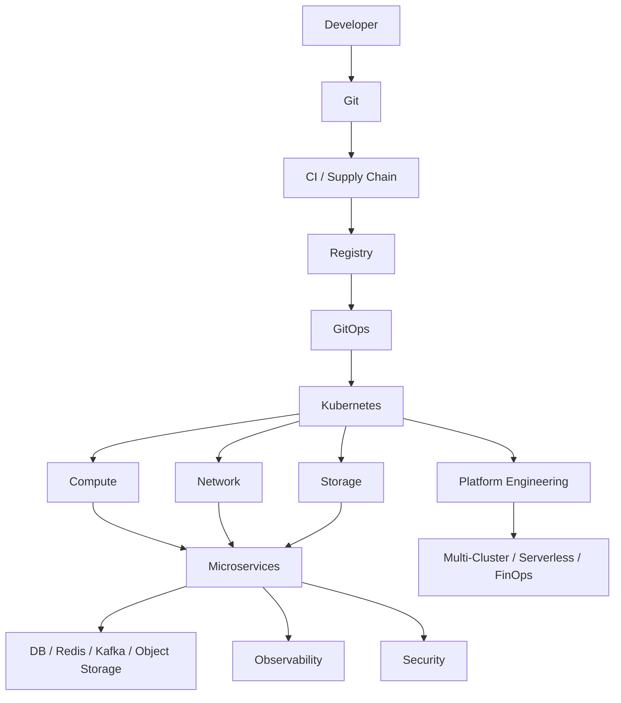

# 11 · 学习路线与云原生架构师检查清单

<div class="chapter-meta"><span>复习地图</span><span>实践路线</span><span>架构检查表</span></div>

## 1. 不要按“产品名称”学习

低效方式：

```text
今天学 Docker
明天学 Istio
后天学 Kafka
```

更好的方式是沿问题主线：

```text
进程怎么隔离？
→ 容器

几千个容器怎么管？
→ Kubernetes

请求怎么找到 Pod？
→ 网络

Pod死了数据怎么办？
→ 存储

服务多了怎么通信和容错？
→ 分布式系统

出了问题怎么看？
→ Observability

代码怎么稳定上线？
→ GitOps

怎么不被攻击？
→ Security

怎么跨地域和控成本？
→ Multi-cluster / FinOps
```

## 2. 第一阶段：Linux 与容器底层

掌握：

- Process / Socket。
- Namespace。
- Cgroup。
- Filesystem / OverlayFS。
- Linux Route / NAT 基础。
- OCI / Image / Runtime。
- containerd / runc。

实践：运行一个容器，查看宿主机 PID、Network Namespace、veth、Cgroup。

## 3. 第二阶段：Kubernetes 核心

掌握：

- Pod / Deployment / ReplicaSet。
- Service / ConfigMap / Secret。
- API Server / etcd。
- Scheduler / kubelet。
- Controller / Reconcile。
- Probe。
- HPA。
- CRD / Operator。

实践：部署应用，手工删除 Pod，观察 Controller 恢复过程。

## 4. 第三阶段：网络

掌握：

- Pod IP / Node IP / Service IP。
- CNI。
- veth。
- Overlay / VXLAN。
- BGP。
- CoreDNS。
- kube-proxy。
- iptables / IPVS。
- eBPF / Cilium。
- Gateway API。
- NetworkPolicy。

实践：追踪一个 HTTP 请求从 Service 到具体 Pod 的路由。

## 5. 第四阶段：存储

掌握：

- Volume。
- PV/PVC。
- StorageClass。
- CSI。
- Block/File/Object。
- StatefulSet。
- Operator。
- Snapshot / Backup / DR。

实践：创建 PVC，让 Pod 重建后继续读取原数据。

## 6. 第五阶段：分布式系统

掌握：

- DDD / Bounded Context。
- REST / gRPC。
- Timeout / Retry / Circuit Breaker / Bulkhead。
- Idempotency。
- CAP / BASE。
- Saga / TCC / 2PC。
- Kafka。
- Outbox。
- CQRS。

实践：实现“本地事务 + Outbox + 幂等 Consumer”。

## 7. 第六阶段：可观测性

掌握：

- RED / USE。
- P95/P99。
- Prometheus。
- Structured Logs。
- OpenTelemetry。
- Trace Context。
- SLI/SLO/Error Budget。

实践：人为制造一个慢 SQL，通过 Trace → Metric → Log 找根因。

## 8. 第七阶段：交付体系

掌握：

- CI。
- Immutable Artifact。
- Registry。
- SBOM / Signature。
- Helm / Kustomize。
- GitOps。
- Argo CD。
- Canary / Blue-Green。
- IaC。
- Platform Engineering。

实践：Push 代码后自动构建镜像，再由 GitOps 控制器部署，而不是 CI 直接 kubectl。

## 9. 第八阶段：安全

掌握：

- IAM / RBAC。
- ServiceAccount。
- Workload Identity。
- Secret Manager。
- Pod Security。
- NetworkPolicy / mTLS。
- Admission / Policy as Code。
- Supply Chain。
- Runtime Security。

实践：让一个违规 privileged Pod 在 Admission 阶段直接被拒绝。

## 10. 第九阶段：高级平台

掌握：

- Multi-cluster。
- RTO/RPO。
- Global Traffic。
- Service Mesh。
- Serverless / Knative。
- KEDA。
- FinOps。
- Developer Platform。

不要一开始就上这一层；没有前面的基础，容易只会配置而不知道为什么。

## 11. 架构设计 12 问

设计任何云原生系统时，至少问：

1. 业务目标和 SLO 是什么？
2. 系统边界在哪里？
3. 哪些服务必须同步，哪些可以异步？
4. 状态放在哪里？
5. 如何保证幂等？
6. 如何处理局部失败？
7. 如何做扩容和容量规划？
8. 如何观测和定位问题？
9. 如何发布与回滚？
10. 身份、权限、Secret、网络如何保护？
11. 数据如何备份和灾难恢复？
12. 成本如何归属和优化？

## 12. 技术选型不是“找最先进”

例如 Service Mesh 并不一定适合 5 个服务的小系统。

选型应回答：

```text
解决了什么真实问题？
复杂度成本是多少？
团队能否维护？
失败模式是什么？
迁移和退出路径是什么？
```

## 13. 一张最终心智模型



## 14. 最终应达到什么程度

当看到一个复杂架构图时，你不再只是识别：

```text
Kubernetes
Kafka
Redis
Prometheus
```

而是能解释：

- 为什么这里需要它。
- 请求和数据怎么经过它。
- 它挂了会怎样。
- 谁负责恢复。
- 它与上下游有什么一致性关系。
- 如何观测。
- 如何安全发布。
- 有没有更简单的替代。

这才是真正的“从零到全貌”。
