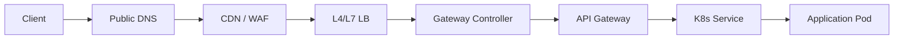

# 12 · 入口流量深潜：DNS、CDN、WAF、LB、Ingress 与 Gateway

<div class="chapter-meta"><span>DNS</span><span>CDN</span><span>WAF</span><span>Load Balancer</span><span>Ingress/Gateway</span></div>

这一章把公网请求进入 Kubernetes 之前和之后的每一跳都展开，不再只保留“DNS → LB → Gateway”几个名词。

## 1. DNS 到底解决什么

用户访问：

```text
https://api.example.com
```

应用最终必须得到 IP 地址。

典型解析过程：

```text
App
→ OS DNS Cache
→ Recursive Resolver
→ Root
→ TLD
→ Authoritative DNS
→ A / AAAA / CNAME
```

现实中 Recursive Resolver 往往由运营商、企业、公共 DNS 或本地网络提供。

DNS 的关键概念：

- A：域名 → IPv4。
- AAAA：域名 → IPv6。
- CNAME：别名 → 另一个域名。
- TTL：缓存多久。
- Negative Cache：不存在结果也可能被缓存。
- Geo DNS / Weighted DNS：按地域或权重返回不同入口。

DNS 不是请求代理，它主要完成“名字到入口”的映射。

## 2. DNS TTL 与故障切换

如果 TTL=300 秒，即使你已经把域名切到新 IP，一些 Resolver 仍可能继续缓存旧结果几分钟。

因此灾备切换需要综合考虑：

```text
DNS TTL
+ 客户端缓存
+ 连接复用
+ CDN 缓存
+ LB 健康检查
```

不能认为“改 DNS = 全部用户瞬间切走”。

## 3. CDN Cache Hit / Miss

静态资源：

```text
Client
→ Edge CDN
```

如果边缘节点已有对象：

```text
Cache Hit
→ 直接返回
```

否则：

```text
Cache Miss
→ 回源 Origin
→ 缓存对象
→ 返回
```

CDN 的核心价值：

- 降低用户到源站的网络距离。
- 减轻源站带宽和 QPS。
- 抗突发。
- 静态内容全球分发。

API 通常不会像图片那样长时间缓存，但 CDN/WAF 平台仍可能承担 TLS、DDoS、Bot 防护和部分 Edge Logic。

## 4. WAF 与传统 Firewall 区别

传统 Firewall 更关注：

```text
IP
Port
Protocol
Connection
```

例如允许 443、拒绝 3306。

WAF 工作得更靠近 HTTP：

```text
Method
Path
Header
Cookie
Body
Query String
```

可以检测：

- SQL Injection。
- XSS。
- Path Traversal。
- Bot/Scanner。
- 异常 User-Agent。
- API Abuse。
- 基于 IP/地区/频率的规则。

## 5. TLS Termination

HTTPS 链路可以有不同终止位置：

```text
Client
→ CDN/WAF TLS Termination
→ LB
→ Gateway
→ Service
```

也可能端到端继续 TLS。

要明确：

- 证书在哪里。
- 哪一跳解密。
- 内网是否再次加密。
- 是否需要 mTLS。
- Header 中如何安全传递原始 Client 信息。

## 6. Load Balancer 的核心

LB 的目标是把一个稳定入口映射到多个健康后端。

常见算法：

### Round Robin
顺序轮询：

```text
R1 → A
R2 → B
R3 → C
R4 → A
```

### Weighted Round Robin
性能更强的节点权重更高。

### Least Connections
把请求优先送给当前连接数较少的实例。

### Hash
根据 Client IP / Header / Key 计算目标。

### Consistent Hash
后端扩缩容时，尽量减少大量 Key 的重新映射，适合需要一定亲和性的场景。

## 7. L4 与 L7 Load Balancing

L4：

```text
IP + Port + TCP/UDP
```

不知道 HTTP Path。

L7：

```text
Host
Path
Header
Cookie
Method
```

例如：

```text
/api/user   → user-service
/api/credit → credit-service
```

不要笼统地把所有 LB 都叫“负载均衡器”，需要知道它在哪一层工作。

## 8. Health Check

LB 不能只“平均分流”，必须知道后端是否健康。

常见：

- TCP Connect。
- HTTP /health。
- HTTPS。
- 自定义应用健康检查。

健康检查失败后，LB 应摘除实例。

但健康检查过于激进也可能因为短暂抖动频繁摘挂后端。

## 9. Ingress Resource 与 Ingress Controller

最容易混淆的一点：

```text
Ingress
= 声明路由规则

Ingress Controller
= 真正读取规则并处理流量的软件
```

例如：

```yaml
host: api.example.com
path: /credit
backend: credit-service
```

真正处理请求的可以是 NGINX、Traefik、HAProxy、Envoy 等 Controller。

## 10. Ingress Controller 自己也是工作负载

典型：

```text
Cloud LB
→ ingress-nginx Service
→ ingress-nginx Pod
→ credit-service
→ credit Pod
```

所以公网入口里可能存在不止一次 Service/LB。

## 11. Gateway API 的角色模型

现代 Gateway API 将职责拆得更明确：

```text
GatewayClass
→ 定义由哪类 Controller 实现

Gateway
→ 平台管理员定义监听器和入口

HTTPRoute / GRPCRoute / TCPRoute
→ 应用团队定义路由
```

这比传统 Ingress 更适合大型平台的职责分离。

## 12. HTTPRoute 与灰度

例如：

```text
credit-v1 weight=90
credit-v2 weight=10
```

可以实现流量权重。

还可按：

- Header。
- Host。
- Path。
- Method。

做精细路由。

## 13. API Gateway 与 Kubernetes Gateway 的边界

Kubernetes Gateway 更关注基础流量路由。  
API Gateway 常承担更多业务 API 治理：

- Authentication。
- Authorization。
- Rate Limit。
- API Key。
- App Version。
- Request Signature。
- Protocol Translation。
- API Composition。

两者可以合并，也可以分层部署。

## 14. externalTrafficPolicy: Local

外部流量进入 Node1，但目标 Pod 在 Node2 时，默认可能多一次跨 Node：

```text
LB
→ Node1
→ Node2 Pod
```

并可能发生 SNAT。

配置：

```text
externalTrafficPolicy: Local
```

可以让 Node 只转发给本机后端，常用于保留真实 Client IP 和减少额外一跳。

代价：

- 某 Node 无本地 Pod 时不能承接。
- 负载分布可能更不均衡。

## 15. 真实 Client IP

经过 CDN/WAF/LB/Gateway 后，后端看到的 Source IP 可能不再是真实用户 IP。

常见使用：

```text
X-Forwarded-For
Forwarded
Proxy Protocol
```

但这些 Header 只能信任由可信代理注入的部分，否则客户端自己伪造就会造成安全问题。

## 16. 一个完整公网请求



分析入口问题时，不要只问“服务挂没挂”，要逐层问：

```text
DNS正确吗？
证书正确吗？
WAF拦了吗？
LB健康吗？
Gateway Route匹配吗？
Service有Endpoint吗？
Pod Ready吗？
```
